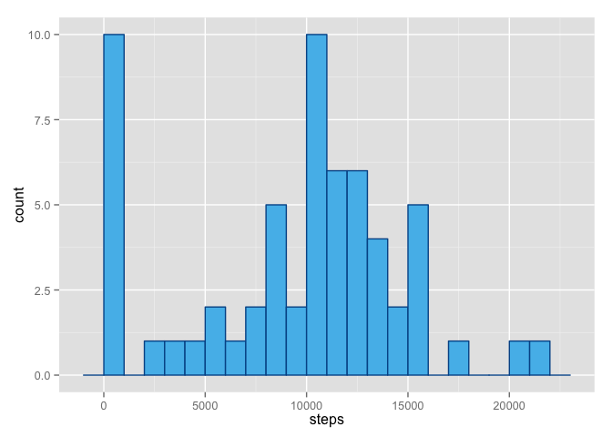
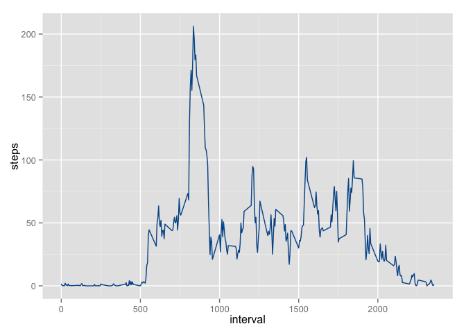
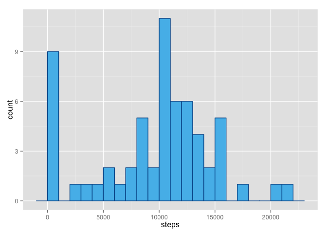
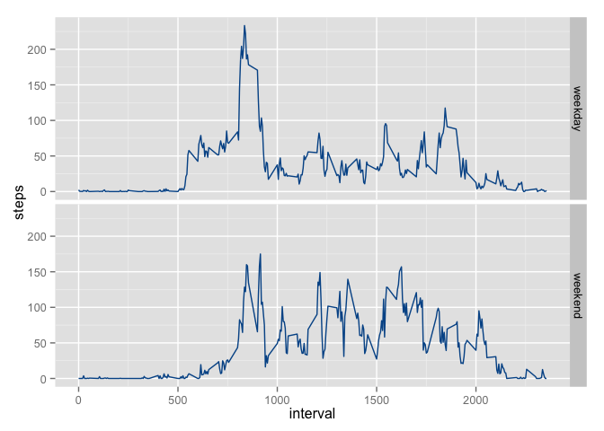

# Reproducible Research: Peer Assessment 1


## Loading and preprocessing the data


```r
if(!("dplyr" %in% installed.packages())){
  install.packages("dplyr")
}
library(dplyr)
```

```
## 
## Attaching package: 'dplyr'
## 
## The following objects are masked from 'package:stats':
## 
##     filter, lag
## 
## The following objects are masked from 'package:base':
## 
##     intersect, setdiff, setequal, union
```

```r
if(!("lubridate" %in% installed.packages())){
  install.packages("lubridate")
}
library(lubridate)
if(!("ggplot2" %in% installed.packages())){
  install.packages("ggplot2")
}
library(ggplot2)

unzip("activity.zip")
data <- read.csv("activity.csv", header = TRUE)
data <- mutate(data, date = ymd(date))
```

## What is mean total number of steps taken per day?


```r
daily.data <- group_by(data, date) %>% summarize(steps = sum(steps, na.rm = TRUE))
ggplot(daily.data) + geom_histogram(aes(x = steps), fill = "#54bceb", color = "#005596", binwidth = 1000)
```

 

```r
mean.steps <- with(daily.data, mean(steps, na.rm = TRUE))
median.steps <- with(daily.data, median(steps, na.rm = TRUE))
cat("Mean total number of steps taken per day: ",
    mean.steps,
    ".\n",
    "Median total number of steps taken per day: ",
    median.steps,
    ".\n", sep = "")
```

```
## Mean total number of steps taken per day: 9354.23.
## Median total number of steps taken per day: 10395.
```

## What is the average daily activity pattern?


```r
daily.activity <- group_by(data, interval) %>% summarize(steps = mean(steps, na.rm = TRUE))
ggplot(daily.activity) + geom_line(aes(x = interval, y = steps), color = "#005596")
```

 

```r
cat("The maximum number of steps is in the interval ",
    with(as.data.frame(daily.activity), interval[steps == max(steps, na.rm = TRUE)]),
    ".\n", sep = "")
```

```
## The maximum number of steps is in the interval 835.
```

## Imputing missing values


```r
cat("Missing values in the dataset: ",
    sum(is.na(data)),
    ".", sep = "")
```

```
## Missing values in the dataset: 2304.
```

```r
#Filling the NA values with the mean of the same interval and creating a new dataset.
na.intervals <- data$interval[is.na(data$steps)]
adjusted.data <- data
adjusted.data$steps[is.na(adjusted.data$steps)] <- daily.activity$steps[daily.activity$interval == na.intervals]

#Creating a new daily dataset with the adjusted dataset.
adjusted.daily.data <- group_by(adjusted.data, date) %>% summarize(steps = sum(steps, na.rm = TRUE))
ggplot(adjusted.daily.data) + geom_histogram(aes(x = steps), fill = "#54bceb", color = "#005596", binwidth = 1000)
```

 

```r
mean.adjusted.steps <- with(adjusted.daily.data, mean(steps, na.rm = TRUE))
median.adjusted.steps <- with(adjusted.daily.data, median(steps, na.rm = TRUE))
cat("Mean total number of steps taken per day: ",
    mean.adjusted.steps,
    ".\n",
    "Median total number of steps taken per day: ",
    median.adjusted.steps,
    ".\nThese values are different from the first part of the report, because the imputed values add up to the mean and median formula.\n",
    sep = "")
```

```
## Mean total number of steps taken per day: 9530.724.
## Median total number of steps taken per day: 10439.
## These values are different from the first part of the report, because the imputed values add up to the mean and median formula.
```

## Are there differences in activity patterns between weekdays and weekends?


```r
adjusted.data <- mutate(adjusted.data, weekdays = wday(date)) %>%
  mutate(weekdays = ifelse(weekdays == 1 | weekdays == 7, "weekend", "weekday")) %>%
  mutate(weekdays = as.factor(weekdays)) %>% group_by(interval, weekdays) %>%
  summarize(steps = mean(steps, na.rm = TRUE))
ggplot(adjusted.data) + geom_line(aes(x = interval, y = steps), color = "#005596") + facet_grid(weekdays ~ .)
```

 
